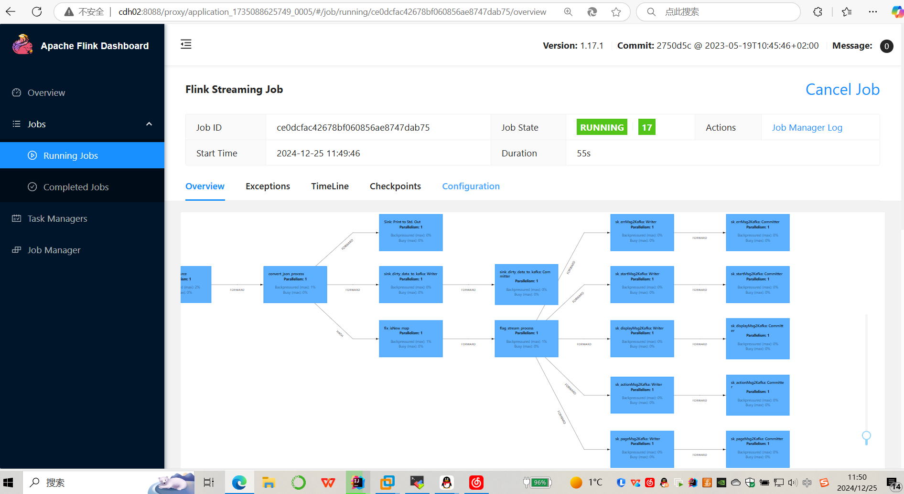

### 日志分流 app-yarn部署
>
### dependency-reduced-pom.xml
>在公司中dependency - reduced - pom.xml是 Maven 项目在构建过程中生成的一个文件。
> 它与常规的pom.xml文件密切相关，主要用于记录经过 Maven 依赖解析和优化后的项目依赖信息。
#### 主要用途
>1.依赖冲突解决展示
>Maven 在处理项目依赖时，可能会遇到依赖冲突的情况。例如，项目的不同依赖项可能会引入相同库的不同版本。dependency - reduced - pom.xml文件会展示 Maven 是如何解决这些冲突的。它会明确列出最终被选择的依赖版本，这样开发者可以清楚地看到实际用于构建项目的是哪些版本的库。
>2.构建优化后的依赖记录
>在构建过程中，Maven 会根据项目的配置和依赖传递规则，对依赖进行优化。这个文件记录了经过优化后的依赖树，剔除了一些不必要的传递依赖。这有助于减小项目构建后的大小，并且确保项目使用的依赖是准确且必要的。
>3.帮助理解项目真实依赖情况
>对于复杂的项目，尤其是有大量依赖的项目，通过查看dependency - reduced - pom.xml，开发者可以快速了解项目实际依赖的核心库及其版本。这对于项目的维护、升级以及故障排查都非常有帮助，例如，当出现类加载问题或者某些功能无法正常工作时，查看这个文件可以帮助确定是否是由于依赖版本变更或者缺失某些依赖导致的。
#### 与 pom.xml 的区别
>pom.xml是 Maven 项目的核心配置文件，开发者在其中声明项目的基本信息、依赖关系、插件配置等。
>而dependency - reduced - pom.xml是 Maven 在构建过程中根据pom.xml和实际的依赖解析情况生成的一个派生文件，
>它更侧重于展示实际被使用的依赖，是对pom.xml中依赖部分的一种优化和记录。
