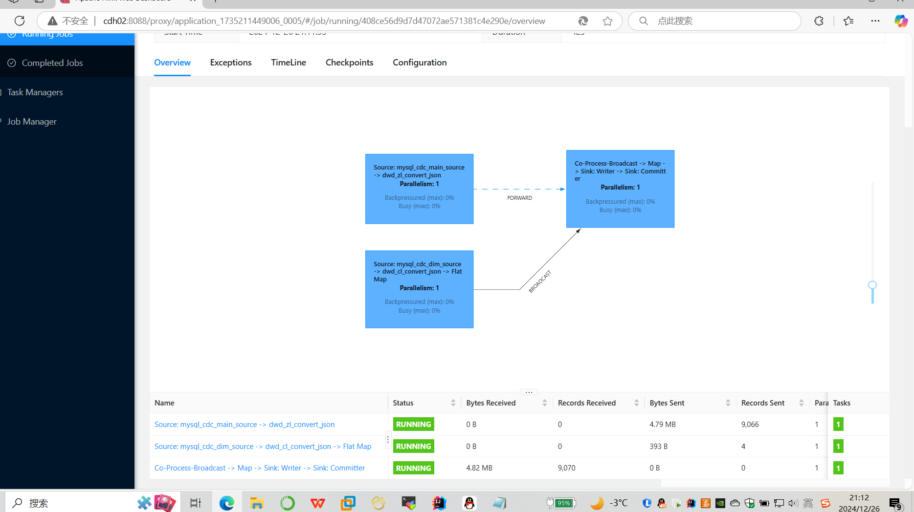
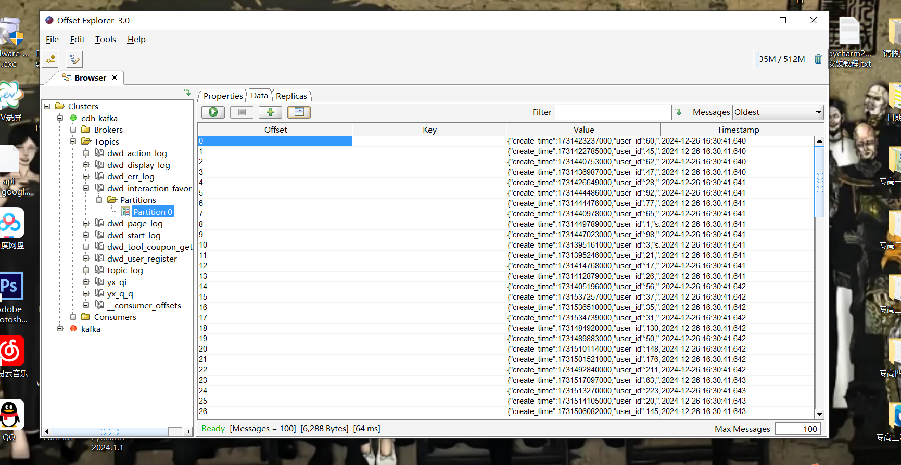

### db 的app-yarn部署

### flink实时程序一般用的什么模型 星型还是雪花模型（都有用到 但是我们用的是星型模型）
#### 星型模型在 Flink 实时程序中的应用
>1.数据组织结构简单清晰：
> 在实时数据处理场景下，例如实时销售数据分析，事实表可以存储如实时订单金额、
> 订单数量等核心度量数据，维度表包含产品信息、客户信息、时间信息等。
> 以一个电商实时数据处理为例，事实表（实时订单表）包含订单 ID、下单时间戳、总金额等字段，
> 维度表有产品维度表（产品 ID、产品名称、品牌等）、客户维度表（客户 ID、客户姓名、地址等）、
> 时间维度表（时间戳、小时、日期等）。这种简单的结构便于在 Flink 程序中进行关联操作，
> 如使用流 join 操作将实时订单流与维度表进行关联，以丰富订单数据。
>2.高效的实时查询和聚合支持：
> Flink 的窗口操作可以方便地基于星型模型进行聚合。
> 例如，在一个基于时间窗口的实时销售统计场景中，
> 通过将实时订单流按照时间窗口（如每小时、每天）进行分组，然后与维度表关联，
> 可以快速计算出每个产品类别、每个客户群体在不同时间窗口内的销售总额、
> 销售数量等指标。这是因为星型模型的结构使得数据在存储和组织上更有利于这种基于事实表度量数据的聚合操作。
>3.适用于简单的实时业务场景：
> 对于一些实时数据处理需求相对简单的业务，如实时监控系统（监控设备的运行状态、实时事件计数等），
> 星型模型可以很好地满足需求。例如，在一个工厂设备监控系统中，
> 事实表记录设备的实时状态数据（如设备 ID、状态码、时间戳），
> 维度表可以包含设备信息（设备 ID、设备名称、设备型号）和位置信息（区域 ID、区域名称），
> 通过 Flink 实时处理，可以快速获取每个区域内不同设备型号的实时状态统计。
### 数据的零点飘逸
>数据零点漂移问题是指数据在时间上出现了偏差，导致数据的准确性受到影响。 
>在离线 数仓 中，数据的零点通常是指ETL（抽取、转换、加载）过程中的时间点，
>即数据被抽取到数仓的时间点。 数据零点漂移问题可能由以下原因导致： 
>1.ETL 过程中的延迟。 如果ETL过程花费的时间超过了预期，那么数据的零点就会向后移动，从而导致数据零点漂移问题。 
>2.数据源 本身存在延迟。
### "时间" 对于flink来说是非常重要的，大致可以分成两大类：事件时间和处理时间(flink的时间语义)
>事件事件：一个数据产生的事件(比如2.30分下单操作，事件时间就为2.30分)
>处理时间：flink拿到数据，开始处理，指数据正在被处理的时刻
#### 为什么会有这两种时间？
>因为数据在网络中传输是具有延迟的，或因某些别的外部原因等。通俗例子，买了牛奶，不一定当天喝。买牛奶这个事件发生的时间为事件时间。喝牛奶这个时间为处理时间。
#### 零点漂移
>前一天23：59：59发送过来的数据，但是由于延迟发送到了下一天的分区，这条数据就具有偏差(离线数仓经典问题)。对于flink，具有事件时间，这个时间点是比较重要的，是保证计算结果准确的重要因素
#### 那这两种时间语义哪个更重要呢？
>在实际生产应用中，事件时间语义可能更为常见。一般情况下，业务日志数据中都会记录数据生成的时间戳(timestamp)，
> 它就可以作为事件时间判断的基础。
### 你做过的最难的业务场景
>解决数据倾斜问题

