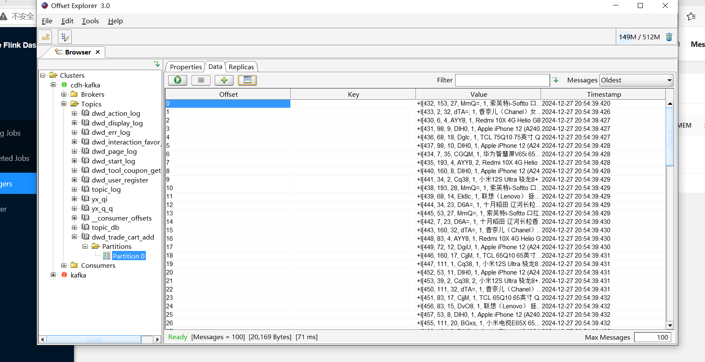

### yarn-app部署

### 常用的数据规范-
>1.数据格式统一，格式有 CSV、JSON、XML ，根据业务需求；
>2.数据脱敏处理：对于涉及个人隐私、商业机密等敏感信息的数据，在进行数据分析和共享之前，
>需要进行脱敏处理，将敏感信息替换为虚构或匿名化的数据，以保护数据主体的隐私
>数据加密传输:采用 SSL加密协议对数据进行加密

### 数据湖
>1.数据湖的目的:是存储所有数据，包括结构化数据（如关系数据库中的表）、半结构化数据（如XML、JSON文件）
>和非结构化数据（如文本文件、图像、音频、视频）就是想保留数据的原始性和完整性，以便后续根据不同的分析需求进行灵活处理；
>2.数据湖的架构:
><1>数据摄入层:如批处理（例如每天或每周将一批数据导入）或流处理（实时或近实时地摄入数据)
><2>存储层：通常基于分布式文件系统构建，如Hadoop分布式文件系统（HDFS）或云存储服务（如亚马逊S3、阿里云OSS）。
>这种存储方式能够支持海量数据的存储，并提供高可用性和可扩展性。存储层不会对数据进行严格的模式定义，数据以其原始格式保存，不同类型的数据可以共存于同一存储系统中。
>3.数据湖的特点:支持多种分析方式
>4:数据湖的应用场景:利用数据湖进行大规模的数据分析,分析用户反馈信息和销售数据，来了解客户需求；
 
### 项目上传
>开发完成后  自测 提交到测试环境 让测试测  测试 提到预发环境中,跑个 2 3  没有问题的话提到 开发环境 在预发中 他们会有 预发计划 然后给项目经理
